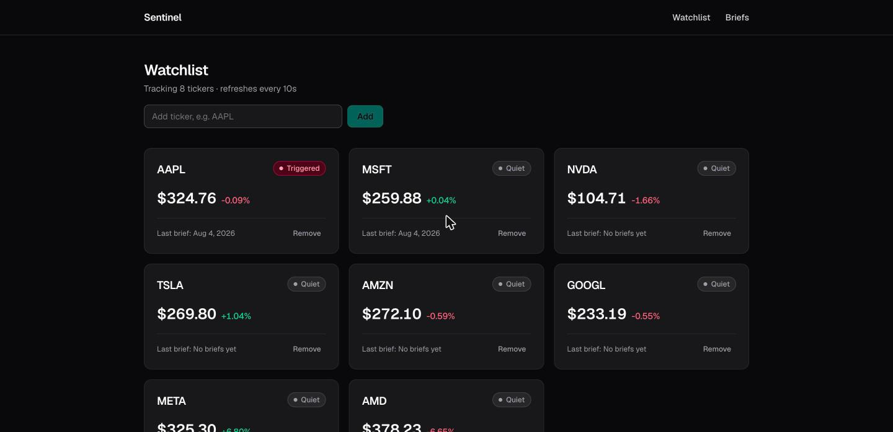
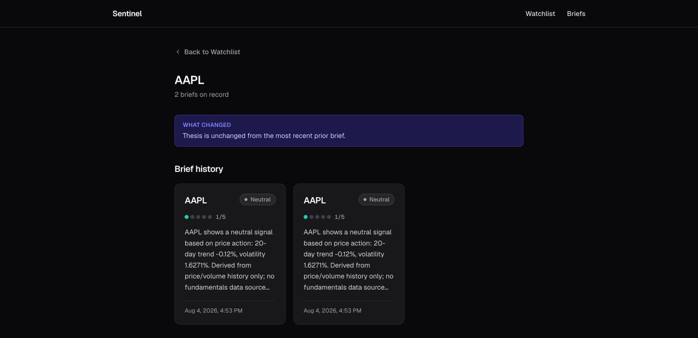
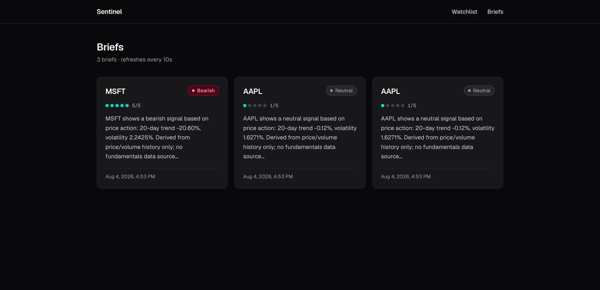
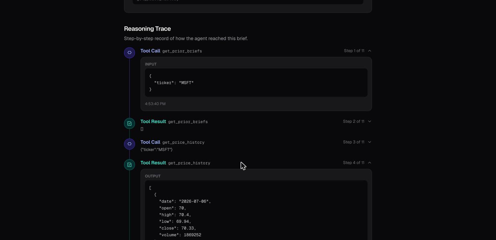

# Sentinel

**An autonomous, two-agent market research system.** Sentinel watches a stock watchlist, decides on its own when something's worth investigating, and runs a multi-step research agent that produces a structured, cited brief — with every reasoning step persisted and inspectable.

Built end-to-end with a spec → plan → implement → review loop: 20 tasks, each with its own test-driven implementation and independent code review before merge.



## How it works

Two agents, two jobs:

- **Watchdog** — runs on a schedule (or on demand), pulls price/volume snapshots for every ticker on the watchlist, and checks them against volume-spike and price-move thresholds. When a threshold crosses, it makes a judgment call — via a rule-based heuristic or a Claude tool call — on whether the move is genuinely unusual or routine noise corroborated by nothing.
- **Analyst** — when the Watchdog escalates, the Analyst runs a real tool-use loop: pulls prior briefs, price history, recent news, and SEC filings, computes its own ratios, and synthesizes a thesis (bullish/bearish/neutral) with confidence, cited evidence, and a suggested action. Every tool call and every intermediate reasoning step is recorded to a trace that ships to the frontend.

| | |
|---|---|
| **Diff against prior research** |  |
| **Full brief feed** |  |
| **Expandable reasoning trace — every tool call, input, and output** |  |

## Why it's demoable with zero API keys

The entire trigger → investigate → brief loop runs offline, deterministically, with no external accounts:

- **`DemoProvider`** — a seeded, deterministic synthetic market-data generator (price walks, volume, templated headlines) used whenever `ALPACA_API_KEY` isn't set. SEC EDGAR itself needs no key at all.
- **`HeuristicBackend`** — a rule-based stand-in for the Claude agent loop, used whenever `ANTHROPIC_API_KEY` isn't set. It runs the *same* tools in the *same* order and produces the *same* trace shape as the real Claude backend — just with deterministic rules instead of an LLM making the call.

Both are drop-in: add real Alpaca/Anthropic keys later and the app switches to live data and real Claude reasoning with no code changes, `REASONING_BACKEND=llm|heuristic` to force one or the other.

## Tech stack

**Backend:** Python 3.12 · FastAPI · SQLAlchemy 2.0 · Alembic · Pydantic v2 · APScheduler · Anthropic SDK · httpx · pytest
**Frontend:** Next.js 14 (App Router) · React · TypeScript · Tailwind CSS

## Architecture

```
providers/   →  services/         →  agents/              →  api/
(market data,   (threshold check,     (Watchdog judgment,      (REST endpoints,
 SEC filings)    orchestration)        Analyst tool loop)       scheduler)
```

- **`providers/`** — `MarketDataProvider` / `FilingsProvider` protocols with three implementations: `DemoProvider` (offline), `AlpacaProvider` (real quotes/news), `EdgarProvider` (real SEC full-text search).
- **`services/`** — `threshold_detector` (pure function, code-level trigger check), `watchdog_service` (per-ticker sweep with per-ticker failure isolation), `analyst_service` (orchestration + persistence, the single chokepoint for `AgentRun`/`Brief` writes).
- **`agents/`** — `ReasoningBackend` protocol with `ClaudeBackend` (real Messages API tool-use loop) and `HeuristicBackend` (deterministic rules) implementations, plus the six-tool registry the Analyst calls into (`get_price_history`, `get_recent_news`, `get_filings`, `get_filing_text`, `calculate_ratios`, `get_prior_briefs`).
- **`api/`** — FastAPI routers for the watchlist, briefs, ticker history, and manual run/tick triggers, wired to an APScheduler background job that ticks the Watchdog every N minutes during market hours.

Every `AgentRun` persists its full step-by-step trace (`tool_call` → `tool_result` → `reasoning` → `final`) — nothing intermediate is discarded, so the frontend's reasoning-trace timeline is a direct read of what the agent actually did, not a reconstruction.

## Quick start

```bash
# Backend
cd backend
python -m venv venv && source venv/bin/activate
pip install -r requirements.txt
cp .env.example .env   # defaults run fully offline — see below
alembic upgrade head
python scripts/seed_demo_data.py   # populates a demo watchlist + briefs
uvicorn main:app --reload

# Frontend (separate terminal)
cd frontend
npm install
npm run dev
```

Open `http://localhost:3000`.

## Optional API keys (the app runs fully offline without them)

Sentinel is designed to run with **zero API keys**: `cp .env.example .env` as-is and everything above works, backed by `DemoProvider` + `HeuristicBackend`.

Both are opt-in upgrades:

- **Anthropic API key** — set `ANTHROPIC_API_KEY` to switch the Analyst/Watchdog over to Claude (`ClaudeBackend`, `claude-sonnet-5` for research, `claude-haiku-4-5` for the cheaper judgment call) instead of `HeuristicBackend`. Force either explicitly with `REASONING_BACKEND=llm|heuristic`.
- **Alpaca API key** (free tier, paper account) — set `ALPACA_API_KEY` / `ALPACA_SECRET_KEY` to switch price/volume/news over to real market data instead of `DemoProvider`'s synthetic data.

See `backend/.env.example` for the full list of environment variables.

## Testing

```bash
cd backend && source venv/bin/activate && pytest -v   # 67 tests, offline, no keys needed
cd frontend && npx tsc --noEmit                        # frontend has no Jest suite by design —
                                                         # verified via tsc + build + live browser walkthrough
```

## Project docs

Built from a full spec, in `sentinel-spec/`:

1. `sentinel-spec/docs/PRD.md` — what we're building and why
2. `sentinel-spec/docs/ARCHITECTURE.md` — how the two agents work and fit together
3. `sentinel-spec/docs/DATA_MODELS.md` — database schema
4. `sentinel-spec/docs/AGENT_TOOLS.md` — exact tool schemas for the Claude API
5. `sentinel-spec/docs/BUILD_PLAN.md` — day-by-day build order

## Explicitly out of scope

No auth, no real trade execution, US equities only, no WebSocket/live-push (polling only), no cloud deployment config — see `docs/superpowers/plans/2026-08-04-sentinel-mvp.md` for the full build plan and its documented cut list.

## License

MIT — see [LICENSE](LICENSE).
